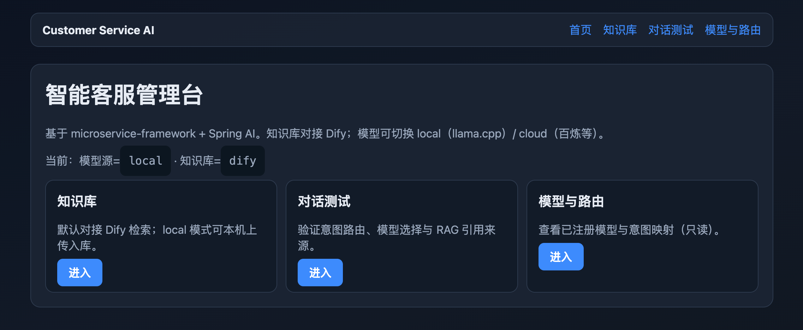
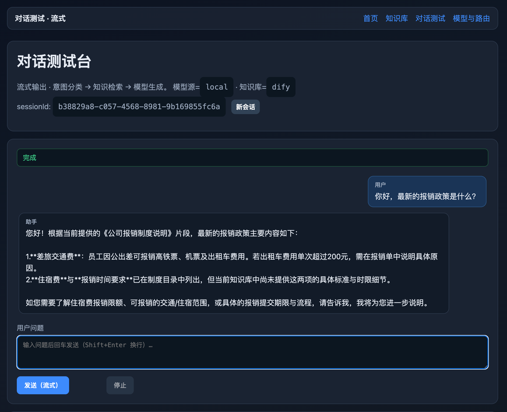
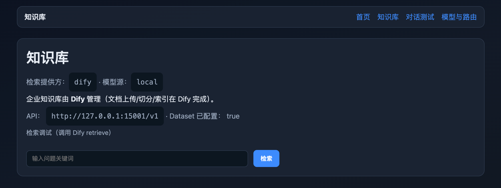
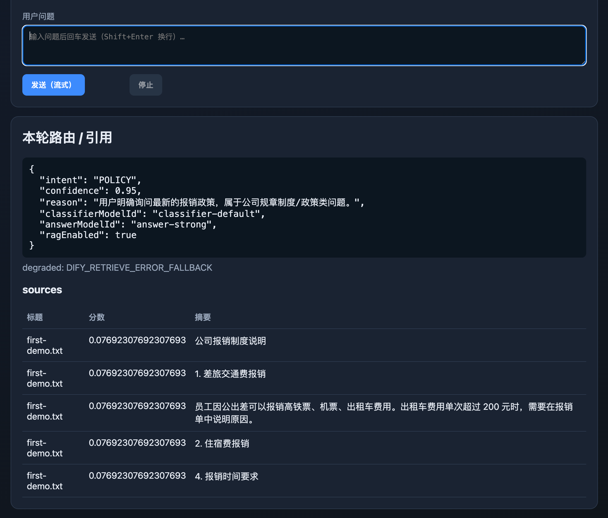
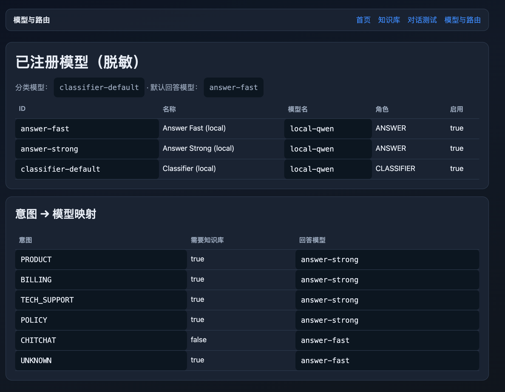

# customer-service-ai

[](LICENSE)
[](https://openjdk.org/)
[](https://spring.io/projects/spring-boot)
[](https://spring.io/projects/spring-ai)
[](https://github.com/andy-library/customer-service-ai/releases)

**English** | [简体中文](README.md)

Enterprise **intelligent customer-service orchestration** built with Spring AI.

| | |
|---|---|
| **Repository** | https://github.com/andy-library/customer-service-ai |
| **Author / Maintainer** | **andy yang** |
| **License** | [Apache License 2.0](LICENSE) |
| **Version** | `0.2.0-rc.1` (quasi-production RC) |

This service is the **orchestration layer** for AI customer service. It does **not** replace your knowledge CMS: knowledge is authored in **Dify** (or optionally local PgVector). The app classifies intent, selects models, retrieves snippets, and generates grounded answers with citations.

---

## Table of contents

- [Features](#features)
- [Architecture](#architecture)
- [Tech stack](#tech-stack)
- [Quick start](#quick-start)
- [Configuration](#configuration)
- [API examples](#api-examples)
- [Admin console](#admin-console)
- [Security](#security)
- [Documentation](#documentation)
- [Project layout](#project-layout)
- [IntelliJ IDEA](#intellij-idea)
- [Tests](#tests)
- [Contributing](#contributing)
- [License](#license)

---

## Features

| Area | Capability |
|------|------------|
| **Routing** | LLM intent classification → answer-model selection |
| **Knowledge** | Dify Dataset retrieve (primary) / local PgVector / none |
| **Models** | Pluggable `local` (llama.cpp) or `cloud` (OpenAI-compatible) |
| **Chat** | Sync JSON + **SSE streaming** (`status` / `delta` / `meta`) |
| **Safety** | Optional API Key auth, rate limiting, session ownership |
| **Quality** | Guardrails, evidence policy, handoff placeholder |
| **Ops** | Health, Micrometer metrics, audit log, Docker, runbook |

---

## Screenshots

Admin console UI (local integration example, for community reference):

### Home



### Streaming chat test

Intent classification → knowledge retrieval → streaming generation; session continuity and sources.



### Knowledge (Dify)

Dify Dataset integration status and retrieval debug entry.



### Retrieval hits

Example of knowledge hit snippets.



### Models & routing

Registered models and intent → answer model mapping (read-only).



---

## Architecture

```text
Client / BFF
    │  X-API-Key (optional)
    ▼
customer-service-ai
  • Auth / rate limit
  • Intent router
  • Model gateway (local | cloud)
  • Knowledge (Dify | local | none)
  • Session / audit / metrics
  • Admin UI (streaming chat)
    │
    ├──► OpenAI-compatible LLM (e.g. llama.cpp :18080)
    ├──► Dify Dataset API (retrieve)
    └──► PostgreSQL (sessions, route logs, audit)
```

See [docs/architecture.md](docs/architecture.md) for the full design.

---

## Tech stack

| Component | Version / notes |
|-----------|-----------------|
| OpenJDK | 21 |
| Spring Boot | 3.3.x (via microservice-framework parent) |
| Spring AI | 1.1.x |
| Parent | `microservice-framework-starter-parent` |
| DB | PostgreSQL (+ PgVector when knowledge=`local`) |
| Knowledge | Dify Dataset API (default) |

---

## Quick start

### Prerequisites

- OpenJDK **21**, Maven **3.9+**, Docker  
- Optional: [llama.cpp](https://github.com/ggerganov/llama.cpp) `llama-server`, [Dify](https://dify.ai/)

### 1) Clone

```bash
git clone https://github.com/andy-library/customer-service-ai.git
cd customer-service-ai
```

### 2) Install framework parent (first time)

```bash
./scripts/install-framework.sh
```

### 3) Start database

```bash
docker compose up -d postgres
```

### 4) Configure

```bash
cp .env.example .env
# Edit secrets and endpoints — never commit .env
```

### 5) Offline demo (no external LLM)

```bash
mvn spring-boot:run -Dspring-boot.run.profiles=mock \
  -Dspring-boot.run.arguments=--server.port=8081
```

### 6) Real models (local llama + Dify example)

```bash
# Ensure chat model is up (OpenAI-compatible), e.g. http://127.0.0.1:18080/v1
# Ensure Dify Dataset API is reachable and DIFY_* is set in .env
set -a && source .env && set +a
mvn spring-boot:run -Dspring-boot.run.arguments=--server.port=8081
```

| URL | Description |
|-----|-------------|
| http://localhost:8081/actuator/health | Health |
| http://localhost:8081/api/v1/ping | Ping |
| http://localhost:8081/admin | Admin UI |
| http://localhost:8081/admin/chat | **Streaming** chat test console |
| http://localhost:8081/swagger-ui.html | OpenAPI |

More detail: [docs/getting-started.md](docs/getting-started.md)

---

## Configuration

| Variable | Meaning |
|----------|---------|
| `CS_AI_MODEL_SOURCE` | `local` \| `cloud` |
| `CS_AI_KNOWLEDGE_PROVIDER` | `dify` \| `local` \| `none` |
| `CS_AI_DEFAULT_BASE_URL` | OpenAI-compatible base URL (…`/v1`) |
| `DIFY_BASE_URL` / `DIFY_API_KEY` / `DIFY_DATASET_ID` | Dify Dataset API |
| `CSAI_SECURITY_ENABLED` | Enable API key authentication |
| `CSAI_API_KEY_CLIENT` / `CSAI_API_KEY_ADMIN` | Client / admin keys |

Full reference: [docs/configuration.md](docs/configuration.md)  
Examples: [`.env.example`](.env.example), [`.env.local-llama.example`](.env.local-llama.example)

---

## API examples

```bash
# Runtime view (model source / knowledge provider)
curl -s http://localhost:8081/api/v1/runtime | jq

# Sync chat (security off)
curl -s -X POST http://localhost:8081/api/v1/chat \
  -H 'Content-Type: application/json' \
  -d '{"message":"How do I request a refund?"}' | jq

# Streaming chat (SSE)
curl -sN -X POST http://localhost:8081/api/v1/chat/stream \
  -H 'Content-Type: application/json' \
  -H 'Accept: text/event-stream' \
  -d '{"message":"How do I request a refund?"}'

# With security enabled
curl -s -X POST http://localhost:8081/api/v1/chat \
  -H 'Content-Type: application/json' \
  -H "X-API-Key: $CSAI_API_KEY_CLIENT" \
  -d '{"message":"How do I request a refund?"}' | jq
```

Response highlights (sync `data`): `answer`, `route` (intent / models / rag), `sources`, `degraded`, `handoff`.

SSE events: `status` → progress phases; `delta` → tokens; `meta` → final route/sources.

---

## Admin console

- Knowledge status / Dify retrieve debug  
- **Streaming dialogue test** (`/admin/chat`)  
- Model & routing overview (read-only)  

---

## Security

For shared or production environments:

```bash
export CSAI_SECURITY_ENABLED=true
export CSAI_API_KEY_CLIENT="$(openssl rand -hex 24)"
export CSAI_API_KEY_ADMIN="$(openssl rand -hex 24)"
```

- Report vulnerabilities privately: [SECURITY.md](SECURITY.md)  
- Operations: [docs/operations/RUNBOOK.md](docs/operations/RUNBOOK.md)

---

## Documentation

| Document | Description |
|----------|-------------|
| [README.md](README.md) (简体中文) | 简体中文说明 |
| [docs/README.md](docs/README.md) | Documentation index |
| [docs/getting-started.md](docs/getting-started.md) | Setup guide |
| [docs/architecture.md](docs/architecture.md) | Architecture |
| [docs/configuration.md](docs/configuration.md) | Configuration reference |
| [docs/requirements/PRD.md](docs/requirements/PRD.md) | Product requirements |
| [docs/acceptance/ACCEPTANCE.md](docs/acceptance/ACCEPTANCE.md) | Acceptance checklist |
| [docs/development/DIFY-AND-MODELS.md](docs/development/DIFY-AND-MODELS.md) | Dify + model backends |
| [docs/development/LOCAL-LLAMA.md](docs/development/LOCAL-LLAMA.md) | Local llama.cpp |
| [docs/development/BAILIAN-GLM.md](docs/development/BAILIAN-GLM.md) | Bailian / cloud OpenAI mode |
| [docs/development/IDEA-RUN.md](docs/development/IDEA-RUN.md) | IntelliJ IDEA run configs |
| [CHANGELOG.md](CHANGELOG.md) | Release notes |
| [CONTRIBUTING.md](CONTRIBUTING.md) | Contribution guide |

---

## Project layout

```text
customer-service-ai/
├── src/main/java/com/enterprise/csai/   # Application modules
├── scripts/                             # Install, smoke, local-llm helpers
├── docs/                                # Documentation
├── samples/                             # Sample knowledge text
├── .run/                                # Shared IDEA run configurations
├── docker-compose.yml
├── Dockerfile
├── README.md                            # English
├── README.md                      # 简体中文
└── pom.xml
```

---

## IntelliJ IDEA

Shared run configurations are under [`.run/`](.run/):

1. Open the project as Maven, set **JDK 21**  
2. `docker compose up -d postgres`  
3. Run **Csai · Mock (offline)** or **Csai · Local Real (llama + Dify)**  

Guide: [docs/development/IDEA-RUN.md](docs/development/IDEA-RUN.md)

---

## Tests

```bash
mvn test
```

Unit tests do not require external LLMs. Docker-based integration tests may be skipped if Docker is unavailable.

---

## Contributing

Contributions are welcome. Please read [CONTRIBUTING.md](CONTRIBUTING.md) and the [Code of Conduct](CODE_OF_CONDUCT.md).

Maintainer: **andy yang**

---

## License

Copyright © 2026 **andy yang**

Licensed under the [Apache License, Version 2.0](LICENSE).  
See also [NOTICE](NOTICE) for third-party attributions.
